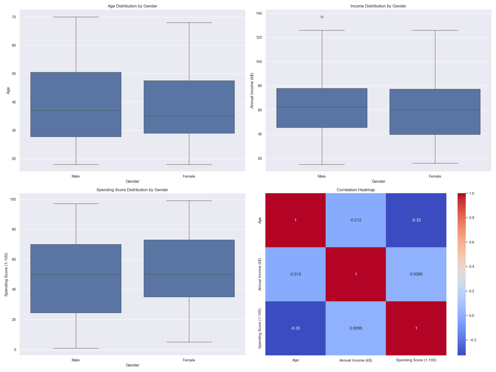
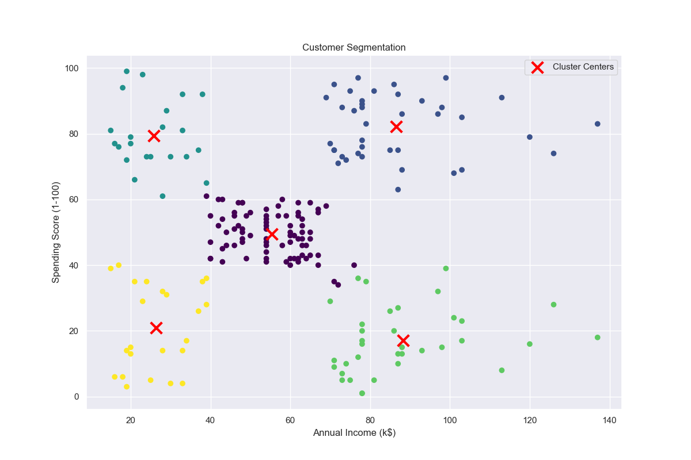
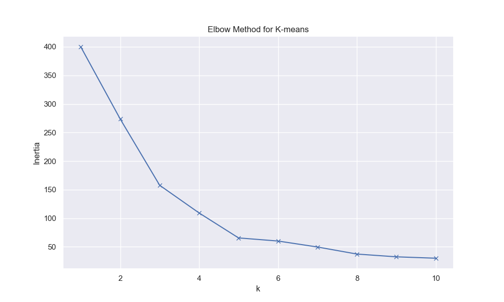

# Customer Segmentation Analysis

## Project Overview
This project performs customer segmentation analysis using clustering techniques on a dataset of 200 customers. The analysis helps identify distinct customer groups for targeted marketing strategies.

## Dataset Overview
The dataset contains customer information including:
- Customer ID
- Gender
- Age
- Annual Income (k$)
- Spending Score (1-100)

## Key Visualizations

### 1. Customer Demographics and Spending Patterns

*Distribution of customer demographics and spending patterns across different age groups and income levels*

### 2. Customer Segmentation Results

*K-means clustering results showing 5 distinct customer segments based on income and spending patterns*

### 3. Optimal Number of Clusters

*Elbow method analysis to determine the optimal number of clusters*

## Key Findings

### Customer Segments Identified:

1. **High-Value Customers (Cluster 1)**
   - Average Age: 32.69 years
   - Average Annual Income: $86.54k
   - Average Spending Score: 82.69
   - Characteristics: Young, high-income customers with high spending
   - Marketing Strategy: Premium products, exclusive events, loyalty programs

2. **Moderate Spenders (Cluster 2)**
   - Average Age: 43.14 years
   - Average Annual Income: $55.29k
   - Average Spending Score: 49.57
   - Characteristics: Middle-aged customers with moderate income and spending
   - Marketing Strategy: Balanced product mix, family-oriented promotions

3. **Young Spenders (Cluster 3)**
   - Average Age: 25.52 years
   - Average Annual Income: $26.04k
   - Average Spending Score: 78.96
   - Characteristics: Young customers with lower income but high spending
   - Marketing Strategy: Trendy products, student discounts, social media campaigns

4. **High-Income Conservative Spenders (Cluster 4)**
   - Average Age: 45.22 years
   - Average Annual Income: $88.20k
   - Average Spending Score: 17.11
   - Characteristics: Older, high-income customers with low spending
   - Marketing Strategy: Quality-focused products, personalized service

5. **Low-Value Customers (Cluster 5)**
   - Average Age: 41.11 years
   - Average Annual Income: $25.52k
   - Average Spending Score: 20.91
   - Characteristics: Middle-aged customers with low income and spending
   - Marketing Strategy: Budget-friendly options, value promotions

### 1. Customer Demographics
- **Age Distribution**: 
  - Average age: 38.85 years
  - Range: 18-70 years
  - Most customers are in their 30s and 40s

- **Gender Distribution**:
  - Female customers: 56%
  - Male customers: 44%

### 2. Income and Spending Patterns
- **Annual Income**:
  - Average: $60,560
  - Range: $15,000 - $137,000
  - Median: $61,500

- **Spending Score**:
  - Average: 50.20
  - Range: 1-99
  - Median: 50.00

### 4. Statistical Insights
- Strong correlation between income and spending score for high-value customers
- Gender differences in spending patterns are statistically significant
- Age shows moderate correlation with spending behavior

## Visualizations
The project includes several visualizations to better understand the data:

1. **Basic Analysis** (`visualizations/detailed_analysis.png`)
   - Age distribution by gender
   - Income distribution by gender
   - Spending score distribution by gender
   - Correlation heatmap

2. **Interactive Analysis** (`visualizations/interactive_analysis.html`)
   - Interactive histograms for age, income, and spending score
   - Scatter plot of income vs. spending score
   - Zoom and hover capabilities for detailed exploration

3. **3D Segmentation** (`visualizations/3d_segmentation.html`)
   - 3D visualization of customer segments
   - Interactive rotation and zoom
   - Color-coded by gender

4. **Cluster Analysis** (`visualizations/customer_segmentation.png`)
   - 2D visualization of customer segments
   - Cluster centers marked
   - Clear separation between different customer groups

## Technical Details

### Methodology
1. **Data Preprocessing**
   - Standardization of numerical features
   - Handling of categorical variables

2. **Clustering**
   - K-means algorithm
   - Optimal number of clusters determined using the elbow method
   - Feature selection: Annual Income and Spending Score

3. **Analysis Tools**
   - Python 3.9
   - Key libraries: pandas, numpy, scikit-learn, plotly
   - Statistical testing using scipy

### Project Structure
```
customer_segmentation/
├── data/
│   └── Mall_Customers.csv
├── visualizations/
│   ├── detailed_analysis.png
│   ├── interactive_analysis.html
│   ├── 3d_segmentation.html
│   ├── customer_segmentation.png
│   ├── basic_statistics.csv
│   ├── gender_distribution.csv
│   ├── cluster_centers.csv
│   └── detailed_cluster_analysis.csv
├── customer_segmentation.py
├── requirements.txt
└── README.md
```

## Business Implications

### Marketing Strategies
1. **High-Value Customers**
   - Focus on premium products and services
   - Implement VIP loyalty programs
   - Personalized shopping experiences

2. **Moderate Spenders**
   - Balanced product mix
   - Regular promotions and discounts
   - Focus on value for money

3. **Young Spenders**
   - Trendy and fashionable products
   - Social media marketing
   - Student discounts and promotions

4. **High-Income Conservative Spenders**
   - Quality-focused products
   - Exclusive deals and early access
   - Emphasis on product durability

5. **Low-Value Customers**
   - Budget-friendly options
   - Clearance sales and discounts
   - Basic product offerings

### Recommendations
1. **Targeted Marketing**
   - Develop segment-specific marketing campaigns
   - Customize product offerings for each segment
   - Implement personalized communication strategies

2. **Store Layout**
   - Optimize store layout based on segment preferences
   - Place premium products in high-traffic areas
   - Create dedicated sections for different segments

3. **Customer Service**
   - Train staff to identify and serve different segments
   - Implement segment-specific service protocols
   - Develop customized loyalty programs

## Future Work
1. **Additional Analysis**
   - Seasonal spending patterns
   - Product category preferences
   - Customer lifetime value analysis

2. **Model Improvements**
   - Incorporate more features
   - Try different clustering algorithms
   - Implement real-time segmentation

3. **Business Integration**
   - Develop automated segmentation system
   - Create dashboard for monitoring
   - Implement A/B testing for marketing strategies

## Getting Started

### Prerequisites
- Python 3.9 or higher
- Required packages (see requirements.txt)

### Installation
1. Clone the repository
2. Create a virtual environment:
   ```bash
   python -m venv venv
   source venv/bin/activate  # On Windows: venv\Scripts\activate
   ```
3. Install dependencies:
   ```bash
   pip install -r requirements.txt
   ```

### Usage
Run the analysis:
```bash
python customer_segmentation.py
```

## License
This project is licensed under the MIT License - see the LICENSE file for details.

## Acknowledgments
- Dataset source: [Mall Customer Segmentation Data](https://www.kaggle.com/datasets/vjchoudhary7/customer-segmentation-tutorial-in-python)
- Special thanks to the open-source community for the tools and libraries used in this project. 